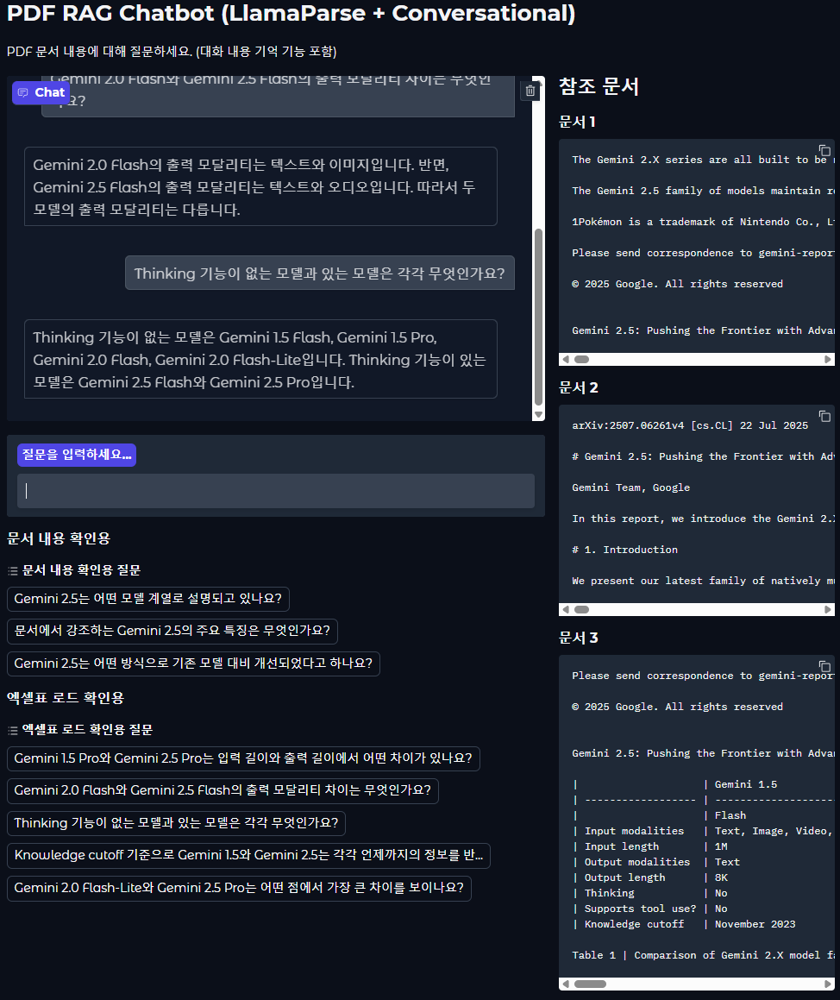
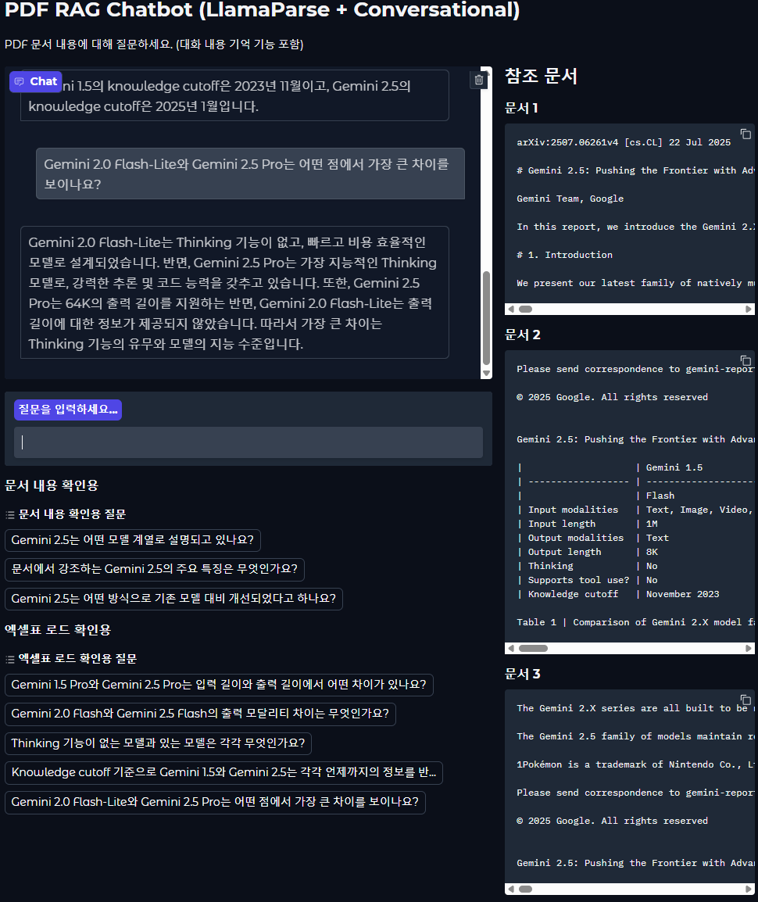
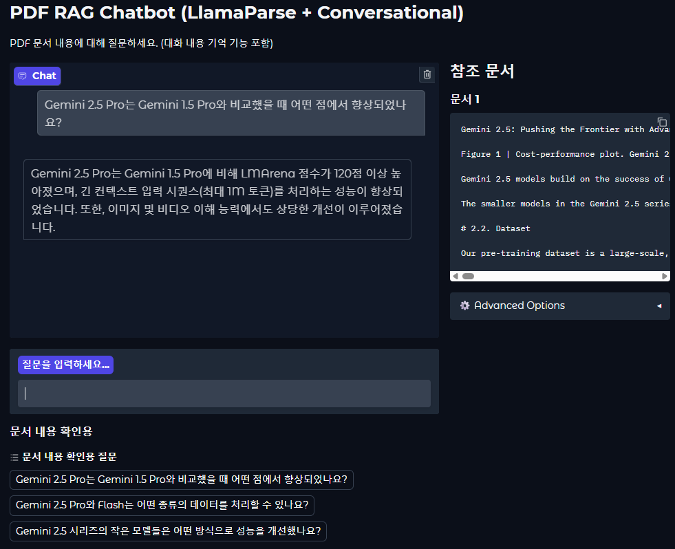

# 미니프로젝트 결과 정리

## 📌 프로젝트 개요
- **주제:** Gemini 2.5 기술 논문 PDF 일부(1~3페이지)를 대상으로 한 RAG 기반 Q&A 시스템 구현
- **목표:** PDF 문서와 표의 내용을 기반으로만 답변하는 챗봇을 구현  
## 🧩 모델 구성
- **LLM:** gpt-4o-mini  
- **Embeddings:** text-embedding-3-small  
- **VectorStore:** Chroma  
- **Retriever:** ParentDocumentRetriever (부모/자식 청크 구조)  
- **Parser/Loader:** LlamaParse (PDF → Markdown 변환 및 로딩)

---

## 📑 구현 내용
- `final_rag_1-2.py` → PDF 1~2페이지 RAG
- `final_rag_3.py` → PDF 3페이지 RAG
- Gradio UI를 통해 질문 입력, 대화 이력 유지, 참조 문서 확인 가능
- 표와 본문 내용에 대한 질문의 답변 생성

---

## 📂 폴더 구조
    project-root/  
    ├── chroma_db/   1-2페이지 벡터스토어 데이터 저장소
    ├── chroma_db2/  3페이지 벡터스토어 데이터 저장소
    ├── loaddata/  LlamaPares 결과파일 저장 폴더
    ├── .env  API 키 등 환경변수 설정 파일
    ├── final_rag_1-2.py  1-2페이지 RAG Gradio 앱 실행 코드
    ├── final_rag_3.py  3페이지 RAG Gradio 앱 실행 코드
    └── requirements.txt 프로젝트 실행에 필요한 라이브러리 목록	
    

---

## 📸 실행 결과 캡쳐

### 1–2페이지 질문 (문서/표)

- **문서 관련 질문**: 본문 내용에서 Gemini 2.5의 특징이나 개선점을 묻는 질문 결과  
  
  
  

- **표 관련 질문**: 모델별 사양과 차이를 정리한 표를 불러와 질문에 답변한 결과  
  
  
  
  
  
  
  

---

### 3페이지 부모 청크 및 질문

- **부모 청크 분할 확인**: 3페이지를 3000자 단위로 나눈 부모 청크 확인 결과  
  

- **부모 청크 기반 질문 (chunk_size=3000)**  
큰 단위 청크(3000자)에서 Gemini 2.5 관련 내용을 불러와 답변한 결과  
  
  
  

- **부모 청크 기반 질문 (chunk_size=1000)**  
부모 청크를 더 작게(1000자) 분할했을 때의 질의응답 결과.  
문서 매칭이 잘 안 된 부분이 있어 답변 품질이 떨어졌을 가능성이 있음.  
  
  
  

---
- **문서에 없는 질문**  
문서에 없는 내용에 대한 질문을 했을때 답변 결과.
"제공된 문서의 내용으로는 답변할 수 없습니다."라고 나옴.

---
## ✅ 잘된 점
- 문서 내 **본문/표의 내용을 기반으로만 답변**  
- 엑셀 표에 대한 질의응답 정상 작동  
- History-Aware Retriever 적용으로 대화 맥락 반영 가능  

---

## ⚠️ 문제점
- `ParentDocumentRetriever` 사용 시:
  - **자식 청크** → `ChromaDB`에 저장됨 (프로그램 종료 후에도 유지)  
  - **부모 청크** → `InMemoryStore`에만 저장됨 → 프로그램 재실행 시 불러올 수 없음  
  - 따라서 실행할 때마다 `chroma_db` 폴더를 수동으로 삭제 후 다시 로딩해야 함

---

## ⏩ 다음에 해볼 것
- 다양한 설정 변경(청크 크기, 리트리버 종류, 아웃파서 적용 등)을 시도하려고 했으나 시간 부족으로 실행까지 이어지지는 못했음.

___
## 🔗 참고
- PDF 출처: [arXiv 2507.06261](https://arxiv.org/pdf/2507.06261)